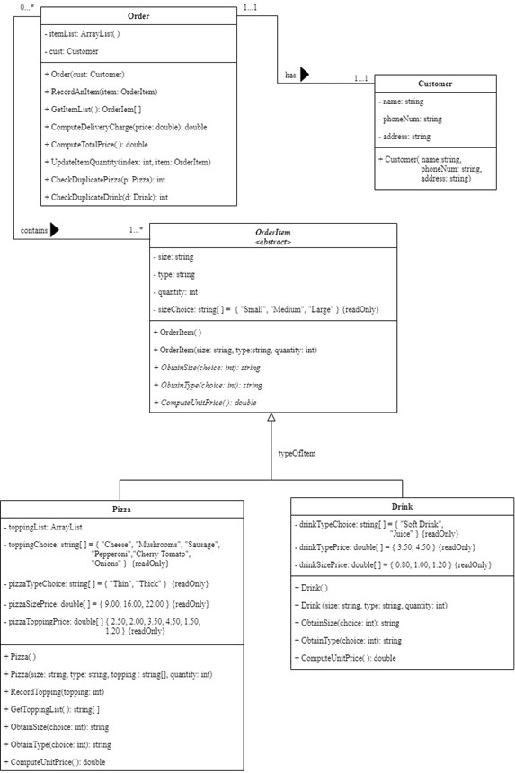
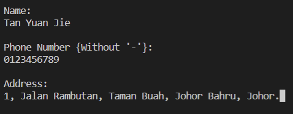
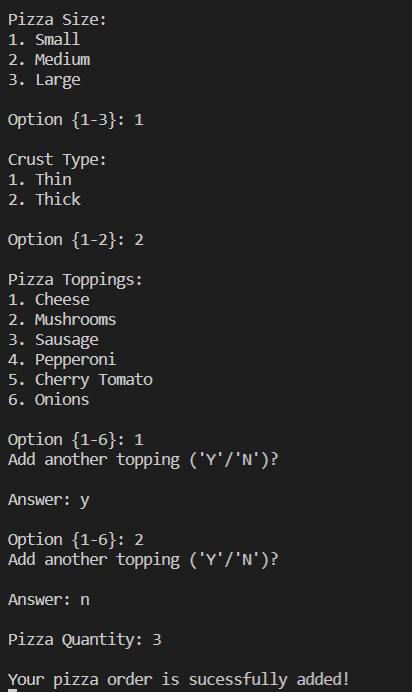
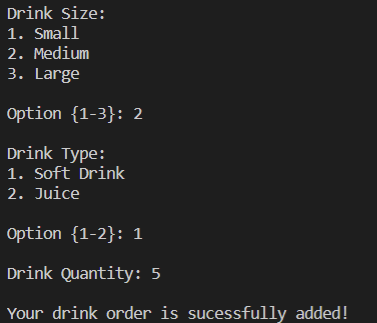
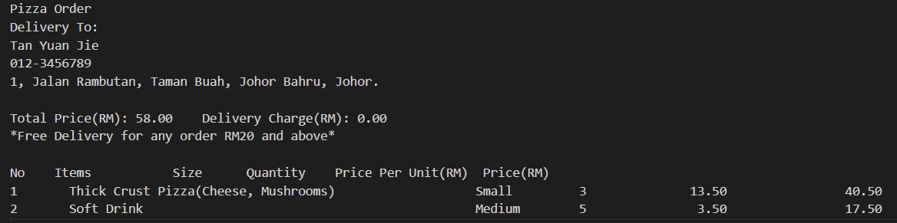

# Pizza Ordering System
<!-- ALL-CONTRIBUTORS-BADGE:START - Do not remove or modify this section -->

<!-- ALL-CONTRIBUTORS-BADGE:END -->

## Overview
A Pizza Restaurant requires an application system to manage pizza ordering. The application is used by restaurant worker to enter the order from customers. The system shall provide users with the following choices: pizza size (small, medium or large), pizza crust type (thin or thick), pizza toppings, as well as small, medium, and large drinks. The user may select specific toppings.
Each topping has a price (for example, cheese RM2.50, mushrooms RM2.00, sausage RM3.50, pepperoni RM4.50, cherry tomato RM1.50, Onions RM1.20 and etc.). The price of a pizza is the sum of the base price (RM 9 for a small pizza, RM 16 for a medium, and RM 22 for a large pizza), plus the sum of the toppings prices. The crust type does not affect the price. On the other hand, the price of a drink is the base price of the drink (RM3.50 for Soft drink, RM4.50 for Juice) multiplied by a size factor (0.8 for small, 1.0 for medium, 1.2 for large drinks).
A user can order multiple pizzas and drinks. Therefore, an order should contain a list of items (pizzas and/or drinks), so that the total price can be calculated and the order can be formatted to be printed. After taking the order, the system shall be able to print an order slip that shows the order information and total price. Every order should include the customer’s delivery address. The delivery charge is RM5 but it is waived for the order RM20 and above.

This system applies object-oriented programming (OOP) approach.

## Tools
1. C#
2. [.NET SDK](https://dotnet.microsoft.com/en-us/download)
3. [.NET Runtime 3.1](https://dotnet.microsoft.com/en-us/download/dotnet/3.1/runtime?cid=getdotnetcore)

## Usage
Run the project with .NET compiler.

## System Design
### Class Diagram
 

## Test
Manual testing has been performed.

## Preview
1. Customer Details Input     
2. Add Pizza     
3. Add Drink     
4. Receipt     
## Contributors ✨

Thanks goes to these wonderful people ([emoji key](https://allcontributors.org/docs/en/emoji-key)):

<!-- ALL-CONTRIBUTORS-LIST:START - Do not remove or modify this section -->
<!-- prettier-ignore-start -->
<!-- markdownlint-disable -->
<table>
  <tr>
    <td align="center"><a href="https://github.com/yuanjie8629"> <b>Tan Yuan Jie</b></a> <a href="#a11y-yuanjie8629" title="Accessibility">️️️️♿️</a> <a href="https://github.com/yuanjie8629/PizzaOrderingSystem/commits?author=yuanjie8629" title="Code">💻</a> <a href="#data-yuanjie8629" title="Data">🔣</a> <a href="#design-yuanjie8629" title="Design">🎨</a> <a href="https://github.com/yuanjie8629/PizzaOrderingSystem/commits?author=yuanjie8629" title="Documentation">📖</a> <a href="#example-yuanjie8629" title="Examples">💡</a> <a href="#ideas-yuanjie8629" title="Ideas, Planning, & Feedback">🤔</a> <a href="#infra-yuanjie8629" title="Infrastructure (Hosting, Build-Tools, etc)">🚇</a> <a href="#research-yuanjie8629" title="Research">🔬</a> <a href="https://github.com/yuanjie8629/PizzaOrderingSystem/commits?author=yuanjie8629" title="Tests">⚠️</a></td>
  </tr>
</table>

<!-- markdownlint-restore -->
<!-- prettier-ignore-end -->

<!-- ALL-CONTRIBUTORS-LIST:END -->

This project follows the [all-contributors](https://github.com/all-contributors/all-contributors) specification. Contributions of any kind welcome!